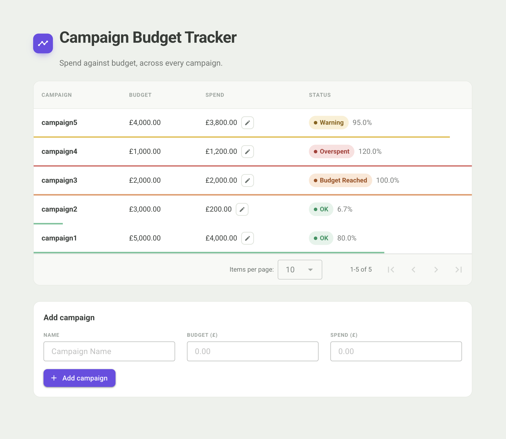

# Campaign Budget Tracker



A full-stack campaign budget tracking tool built for the Brainlabs software engineer coding task.

Account managers can add campaigns, track spend against budget, and update spend as it changes. Each campaign is automatically assigned a status based on how much of its budget has been used.

---

## Stack

| Layer | Technology |
|---|---|
| Frontend | Vue 3 + Vuetify + TypeScript |
| Backend | Django + Django REST Framework |
| Database | SQLite |
| Containerisation | Docker + docker-compose |

---

## Running the app

### With Docker (recommended)

The quickest way to get the app running. You will need [Docker Desktop](https://www.docker.com/products/docker-desktop/) installed and running.

```bash
git clone <your-repo-url>
cd bl_budget_tool
docker-compose up --build
```

Then open [http://localhost:3000](http://localhost:3000) in your browser.

The backend API is available at [http://localhost:8000/api/campaigns/](http://localhost:8000/api/campaigns/).

> On subsequent runs you can omit `--build` and just use `docker-compose up`.

---

### Running locally (without Docker)

**Backend**

```bash
cd backend
python -m venv venv
source venv/bin/activate       # Windows: venv\Scripts\activate
pip install -r requirements.txt
python manage.py migrate
python manage.py runserver
```

The API will be available at [http://localhost:8000](http://localhost:8000).

**Frontend**

In a separate terminal from the project root:

```bash
npm install -g pnpm   # skip if you already have pnpm
pnpm install
pnpm dev
```

Then open [http://localhost:5173](http://localhost:5173) in your browser.

---

## Running the tests

```bash
cd backend
source venv/bin/activate
python manage.py test campaigns
```

The test suite covers campaign status logic, all API endpoints, input validation, and edge cases.

---

## Campaign statuses

| Status | Condition |
|---|---|
| OK | Spend is below 90% of budget |
| Warning | Spend is 90% or more of budget |
| Budget Reached | Spend equals budget exactly |
| Overspent | Spend exceeds budget |

---

## Project decisions

See [DECISIONS.md](DECISIONS.md) for an explanation of the key technical choices made during development.
